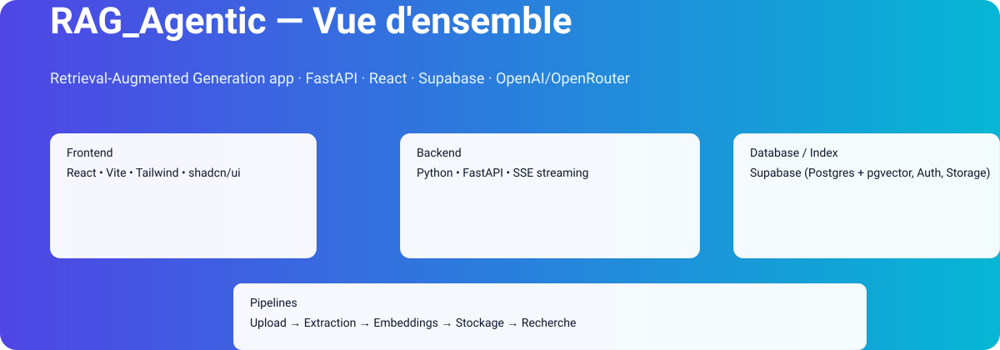

# RAG_Agentic



> Un projet RAG (Retrieval-Augmented Generation) complet — ingestion de documents, API de chat, interface web et pipelines d'observabilité.

## Vue d'ensemble

RAG_Agentic est une application full-stack destinée à fournir une expérience de chat enrichie par des documents (ingestion manuelle). Le projet inclut :

- Backend : Python + FastAPI
- Frontend : React + Vite + Tailwind + shadcn/ui
- Base de données : Supabase (Postgres + pgvector, Auth, Storage)
- LLM : OpenAI / OpenRouter
- Observabilité : LangSmith

Cette README offre instructions d'installation, architecture, scripts utiles, et guides de contribution.

---

## Fonctionnalités principales

- Ingestion de documents (upload manuel) avec indexation vectorielle
- Chat en streaming (SSE) avec historique et gestion des prompts
- Architecture modulaire (modules LLM interchangeables)
- Tests et suite de validation incluse (.agent/validation)
- Règles de sécurité : Row-Level Security sur toutes les tables

---

## Architecture (vue globale)

L'image en haut donne une vue simplifiée :

- Frontend (React) communique en REST / SSE avec le Backend (FastAPI)
- Backend interagit avec Supabase (auth, stockage, pgvector) et les services LLM
- Pipelines d'ingestion : upload -> extraction -> embeddings -> stockage
- Observabilité et logs centralisés via LangSmith

---

## Prérequis

- Python 3.10+
- Node 18+
- Powershell (sur Windows) pour les scripts fournis
- Compte Supabase et clés API
- Variables d'environnement (voir section suivante)

---

## Variables d'environnement (exemples)

Fichier .env (ne pas committer dans Git) :

```
# Supabase
SUPABASE_URL=
SUPABASE_SERVICE_ROLE_KEY=
SUPABASE_ANON_KEY=

# OpenAI / OpenRouter
OPENAI_API_KEY=
OPENROUTER_API_KEY=

# LangSmith
LANGSMITH_API_KEY=

# App settings
DATABASE_URL=
FRONTEND_URL=http://localhost:5173
BACKEND_URL=http://localhost:8000
```

---

## Scripts utiles (Windows / PowerShell)

Les scripts se trouvent dans le dossier `scripts/` et doivent être lancés avec PowerShell :

- Start backend : `powershell -File scripts\start-backend.ps1`
- Start frontend : `powershell -File scripts\start-frontend.ps1`
- Start both : `powershell -File scripts\start-all.ps1`
- Restart backend : `powershell -File scripts\restart-backend.ps1`

Vérification santé backend :

```
curl http://localhost:8000/health
# Doit renvoyer {"status":"ok"}
```

---

## Développer localement

1. Créer et activer l'environnement Python :

```powershell
python -m venv backend\venv
backend\venv\Scripts\Activate.ps1
pip install -r backend\requirements.txt
```

2. Installer le frontend :

```powershell
cd frontend
npm install
npm run dev
```

3. Démarrer le backend :

```powershell
powershell -File scripts\start-backend.ps1
```

---

## Tests & Validation

La suite de validation est dans `.agent/validation/full-suite.md`. Ajouter des tests curl pour chaque nouvel endpoint et des tests E2E pour les nouveaux flux UI.

---

## Contribuer

Merci de contribuer !

- Fork puis PR vers la branche principale
- Respecter les conventions (voir CLAUDE.md dans le dépôt)
- Mettre à jour `.agent/validation/full-suite.md` pour chaque nouvelle fonctionnalité

---

## Licence

MIT — voir le fichier LICENSE pour les détails.

---

## Contact

Mainteneur : amine-LabsCraft
Repo : https://github.com/amine-LabsCraft/RAG_Agentic-

Bonne exploration !
